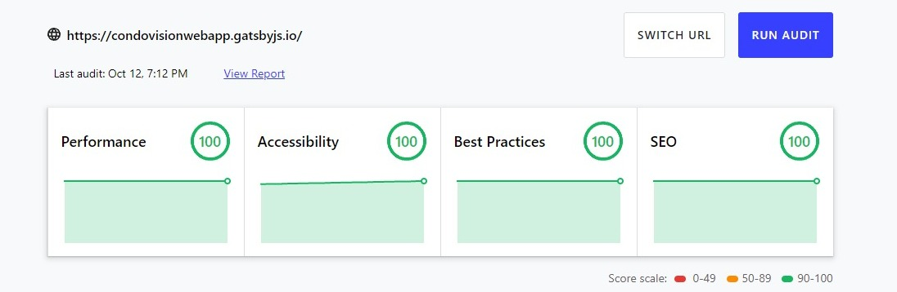

 

  

<h3 align="center">Condovision - Sistemas eletrônicos</h3>

  

    Static appication to the company show their services.
     
    <a href="https://github.com/kevin-kuhn/condovision-web-app/tree/master/condovision-webapp"><strong>Explore the docs »</strong></a>
     
     
    <a href="https://condovisionwebapp.gatsbyjs.io">View Demo</a>
    ·
    <a href="https://github.com/kevin-kuhn/condovision-web-app/issues">Report Bug</a>
  

## About The Project

This app was developed focusing in SEO and Performance, and the layout was created together with the company. The figma layout can be founded [here](https://www.figma.com/file/WSFHVhTFSpjDGMGw2W4Acz/Condovision?node-id=0%3A1).

The audit results are from [we.dev](https://web.dev/measure/).  

### Built With

* [Gatsby.js](https://www.gatsbyjs.com/)
* [React.js](https://reactjs.org/)
* [Tailwind CSS](https://tailwindcss.com/)
* [PostCSS](https://postcss.org/)

